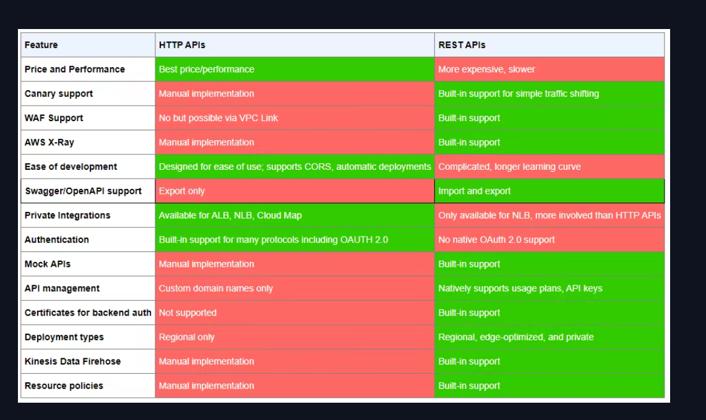
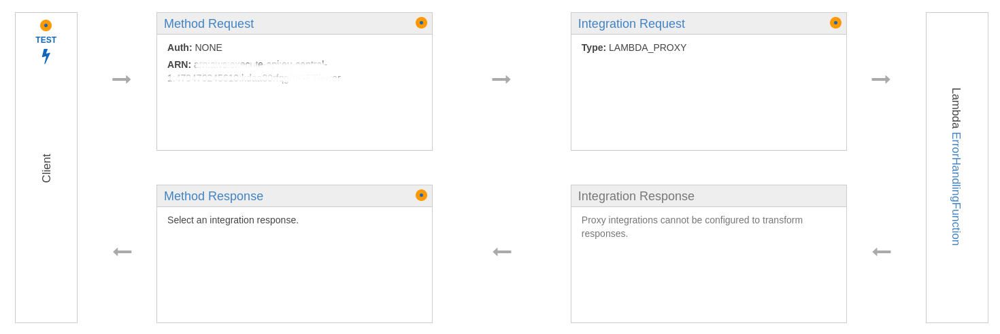

# AWS ApiGateway

### Http vs. Rest Api


### Integration response
- integr-resp comes into play when lambda function returns a valid response that you can further customize.
- https://www.alexdebrie.com/posts/api-gateway-elements/#vocabulary-time-service-proxies-vs-proxy-integrations-vs-proxy-resources



### Gateway response
- as opposed to Integration Response, Gateway Response is used to handle errors before a request hits your backing integration
- for a invalid request Api Gateway bypasses the integration altogether and returns a error response
- https://docs.aws.amazon.com/serverless-application-model/latest/developerguide/serverless-controlling-access-to-apis-customize-response.html

### Lambda Proxy
- passes to the Lambda function the raw request as-is (except the order of the parameters), and outputs a response of the following format:
```
{
    "isBase64Encoded": true|false,
    "statusCode": httpStatusCode,
    "headers": { "headerName": "headerValue", ... },
    "multiValueHeaders": { "headerName": ["headerValue", "headerValue2", ...], ... },
    "body": "..."
}
```
- when using Lambda Proxy you don't need to config a integration response
- you use it when you want to have more control over your backend integration and you want to do the body transformation 
in your endpoint logic where it can be easily tested using your native tooling