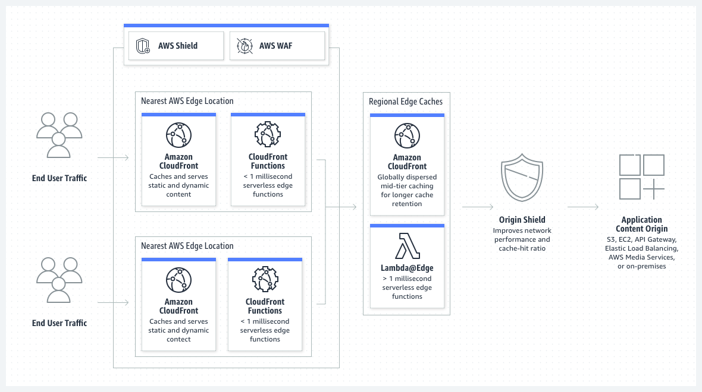

## CloudFront
Amazon CloudFront is a content delivery network (CDN) service built for high performance, security, and developer convenience.

**CloudFront** is ideal for lightweight, short-running functions for use cases like the following:
- Cache key normalization – You can transform HTTP request attributes (headers, query strings, cookies, and even the URL path) to create an optimal cache key, which can improve your cache hit ratio.
- Header manipulation – You can insert, modify, or delete HTTP headers in the request or response. For example, you can add a True-Client-IP header to every request.
- URL redirects or rewrites – You can redirect viewers to other pages based on information in the request, or rewrite all requests from one path to another.
- Request authorization – You can validate hashed authorization tokens, such as JSON web tokens (JWT), by inspecting authorization headers or other request metadata.
- To get started with CloudFront Functions, see Customizing at the edge with CloudFront Functions.

**Lambda@Edge** is a good fit for the following scenarios:
- Functions that take several milliseconds or more to complete.
- Functions that require adjustable CPU or memory.
- Functions that depend on third-party libraries (including the AWS SDK, for integration with other AWS services).
- Functions that require network access to use external services for processing.
- Functions that require file system access or access to the body of HTTP requests.

User <----> CloudFront <----> LambdaEdge <----> Lambda (located in a DataCenter)

###Resources:
https://docs.aws.amazon.com/AmazonCloudFront/latest/DeveloperGuide/edge-functions.html?icmpid=docs_cf_help_panel#edge-functions-choosing
